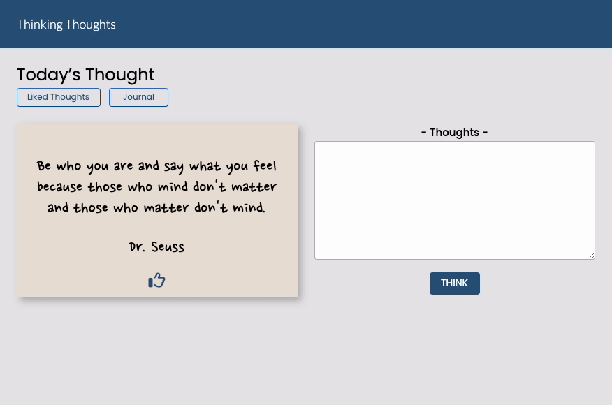

# thinking-thoughts

## A dynamic HTML, CSS, and JavaScript solo project.

This project explores the functionality of a web application for individuals who want to be encouraged and journal their thoughts.

In what is perhaps one of the most digitally connected eras known to human kind, people are often heard talking about feelings of isolation. The purpose of this simple application is to provide a randomized, inspirational quote that will encourage users to use the text field to "soundboard" their thoughts - wins, losses, joys, frustrations, etc. - with the option to save and return to their entries - or simply "like" the quote without saving their thoughts.

**[Click Here To View Live Demo](https://d-tak.github.io/thinking-thoughts "Thinking Thoughts - an AJAX project")**

## Technologies Applied
* HTML
* CSS
* JavaScript
* XMLHttpRequest
* Public Application Programming Interface (API)
  * [Inspiration API](https://api.goprogram.ai/inspiration/docs/ "Inspiration API")

## Application Features
* Users can view randomly generated inspirational quotes.
* Users can "like" quotes.
* Users can view their "liked" quotes.
* Users can enter a Journal Entry and think their thoughts.
* Users can view entries for liked quotes and logged journals.

## Application Preview

## Stretch Features
* Users can delete their entries.
* Users can share a quote.

## Getting Started
* To access this project, click on the provided url.
* Upon first glance, users will be presented with a quote that is automatically generated from the API.
* Users can navigate through the application by utilizing the provided buttons or return to the landing page by clicking on the title, "Thinking Thoughts"
